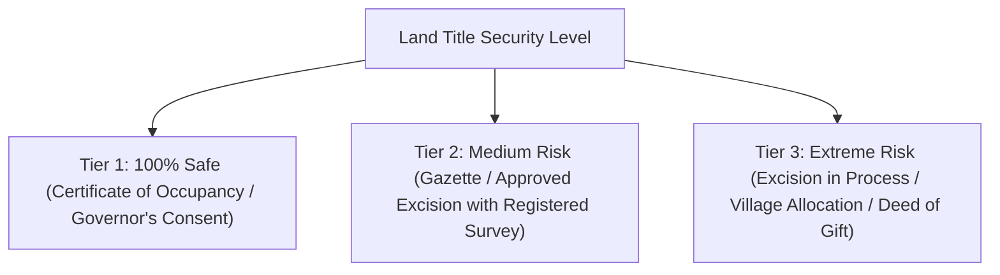

# 🗺️ LEKKI-EPE & COASTAL HIGHWAY LAND RISK & DEMOLITION DOSSIER
### *The 2026 Title Verification & Scam-Proof Land Investor Blueprint*
**Published by Bethelmind Analytics | Real Estate Due-Diligence & Cadastral Intelligence Unit**

---

## 📌 TABLE OF CONTENTS
1. **The 2026 Lagos Land Reality & Coastal Highway Demolition Buffer Analysis**
2. **Title Hierarchy & Legal Risk Matrix (Governor's Consent vs. Gazette vs. Excision vs. Court Judgement)**
3. **Step-by-Step GPS Beacon Coordinate Plotting on Google Earth Pro**
4. **The "Omo-Onile" & Community Double-Selling Scam Defense System**
5. **Standard Land Purchase Agreement & Indemnity Clause Template**

---

## 1. 2026 LAND RISK & DEMOLITION BUFFER OVERVIEW
The Federal Ministry of Works and Lagos State Government have enforced strict **Right of Way (RoW) corridors** across the Lagos-Calabar Coastal Highway, Fourth Mainland Bridge alignment, and Lekki Regional Road corridors. 

### ⚠️ Critical Demolition & Acquisition Buffer Zones (2026 Update):
| Corridor / Axis | Statutory Right of Way (Buffer) | High-Risk Locations / Estates | Safe Acquisition Status |
| :--- | :--- | :--- | :--- |
| **Lagos-Calabar Coastal Highway** | 100m to 250m from Shoreline/Alignment | Okun Ajah, Lafiaji coastal belt, parts of Elegushi, Okun Mopo | Only properties outside designated gazetted alignment with formal excision |
| **Fourth Mainland Bridge Alignment** | 120m corridor width | Langbasa, Baiyeku, Isawo, parts of Ajah inland | Structures within the earmarked alignment will NOT receive planning approval |
| **Lekki-Epe Expressway Widening** | 45m from center line | Eleko Junction to Epe T-Junction | Any structure built on the road drainage easement is subject to removal |
| **Free Trade Zone & Airport Axis** | Dedicated Industrial Reserve | Alaro City boundaries, Magbon Alade, Origanrigan | Check for formal State Acquisition Revocation before buying |

---

## 2. TITLE HIERARCHY & LEGAL RISK MATRIX

Not all "titles" in Lagos are created equal. Understand what you are paying for:



### 📋 Title Comparison Matrix:
| Title Document | Legal Strength | Can You Get Governor's Consent? | Risk Level | Due Diligence Action Required |
| :--- | :--- | :--- | :--- | :--- |
| **Certificate of Occupancy (C of O)** | ⭐⭐⭐⭐⭐ (Highest) | Already Issued (State Lease for 99 yrs) | **0% Risk** | Verify authenticity at Alausa Land Registry; check for court caveats. |
| **Governor's Consent** | ⭐⭐⭐⭐⭐ (Highest) | Yes (Already Perfected) | **0% Risk** | Ensure seller is the named grantee in the registered conveyance. |
| **Gazette (Excision Document)** | ⭐⭐⭐⭐ (High) | Yes (Eligible for Governor's Consent) | **Low Risk** | Confirm land coordinates fall inside the excised page and boundary beacons. |
| **Excision in Process ("File Number")** | ⭐ (Fake Security) | ❌ NO | **85% Extreme Risk** | A file number is NOT a title. The state can reject the application anytime. |
| **Court Judgement / Family Receipt** | ⭐ (High Dispute) | ❌ Complex | **90% Extreme Risk** | High likelihood of rival family factions selling the same plot twice. |

---

## 3. HOW TO PLOT GPS BEACON COORDINATES ON GOOGLE EARTH PRO (FREE)

Never buy land without checking the survey beacon coordinates on satellite maps:

1. **Obtain the Registered Survey Plan (Red Copy):**
   * Look at the 4 corner points of the plot. Note the 6-digit Easting ($E$) and 7-digit Northing ($N$) coordinates (e.g. $N: 712345.67$, $E: 589012.34$ in Minna Datum / UTM Zone 31N).
2. **Download & Open Google Earth Pro (Desktop):**
   * Go to `Tools` $\rightarrow$ `Options` $\rightarrow$ `3D View` $\rightarrow$ Under "Show Lat/Long", select **Universal Transverse Mercator (UTM)**.
3. **Plot the Corner Placemarks:**
   * Click `Add Placemark`. Enter the Zone (`31 N`), Easting, and Northing values for each of the 4 beacon numbers.
4. **Inspect Satellite Imagery & Elevation:**
   * Use the **Historical Imagery Slider** (clock icon) to view the land over the last 10–15 years.
   * *Look for:* Has this land been underwater during rainy seasons? Is there a designated drainage canal running through it? Are there high-tension power cables within 30 meters?

---

## 4. THE "OMO-ONILE" DOUBLE-SELLING SCAM DEFENSE

### 🛡️ The 5 Golden Rules of Safe Land Acquisition:
1. **Never pay money to a "family representative" without an executed Power of Attorney or Deed of Partition** signed by the accredited family head and principal members.
2. **Search the Alausa Land Registry (Form 1C Search):** Confirm whether the land is encumbered by commercial bank mortgages or litigation caveats.
3. **Conduct an Immediate Physical Possession:** Within 48 hours of purchase, construct a 4-coach perimeter fence, erect an iron gate, install a permanent signboard with your phone number, and deposit gravel/sand on site.
4. **Lagos State Physical Planning Permit (LASPPPA):** Check zoning status before planning a multi-unit development.

---

## 5. STANDARD LAND PURCHASE INDEMNITY CLAUSE TEMPLATE

```text
SPECIAL INDEMNITY & TITLE WARRANTY CLAUSE (For insertion into Deed of Assignment)

"The Vendor hereby unconditionally warrants and covenants with the Purchaser that the Vendor is the absolute beneficial owner of the subject property free from all encumbrances, customary pledges, government acquisitions, pending litigations, or rival family claims.

In the event that the title of the Purchaser is disrupted, impeached, revoked by government acquisition, or challenged by any third party due to defect in the Vendor's root of title, the Vendor shall immediately, without demur, fully indemnify and refund to the Purchaser the entire purchase sum of ₦__________________, alongside all ancillary development costs, professional fees, and interest calculated at the prevailing CBN Monetary Policy Rate (MPR) from the date of execution."

Signed by Vendor: __________________________ Date: _________________
In the presence of (Principal Family Head): _______________________
```

---
*Asset Pack Prepared by Bethelmind Analytics Real Estate Cadastral Desk | Inquiries: bethelmindrecruit@gmail.com | WhatsApp: +234 802 279 1227*
