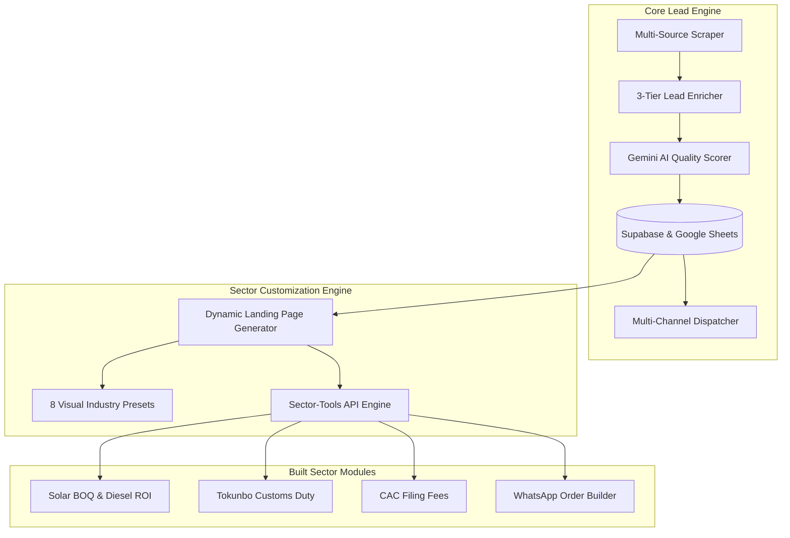
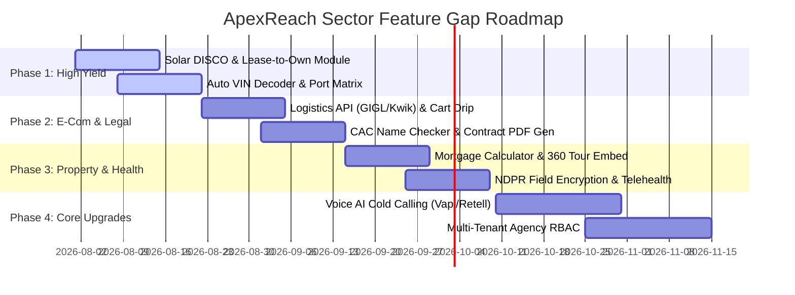

# ApexReach Lead Generation Platform — Sector-by-Sector Feature Gap Analysis

This document provides a comprehensive audit and feature gap analysis for the **ApexReach B2B Lead Generation & Revenue Automation Platform**. It evaluates current platform capabilities against sector-specific demands across 8 primary commercial verticals, identifying critical missing features, operational bottlenecks, and an engineering execution roadmap to achieve total market dominance.

---

## 1. Executive Summary & Audit Scope

ApexReach combines automated lead scraping (Google Places, Jiji, OSM, social crawlers), multi-tier enrichment (Cheerio crawl, Playwright phone extraction), AI lead scoring (Gemini 1.5 Flash), bi-directional Google Sheets CRM synchronization, and multi-channel outbound messaging (WhatsApp via Baileys/Meta Cloud, Email, SMS).

While the underlying infrastructure handles generalized B2B outreach efficiently, high-converting B2B lead engines require **industry-tailored conversion mechanics** (custom ROI calculators, instant quote generators, verification portals, and localized compliance tooling). 

This analysis audits ApexReach's existing codebase (`src/lib/sectorModules.ts`, `src/app/api/sector-tools/route.ts`, and interactive client components) across 8 target industries to outline existing capabilities, identify critical functional gaps, and define actionable development priorities.

---

## 2. Platform Capability Baseline (Current State)

### Active Core Features:
1. **Multi-Source Lead Extraction**: Headless scraping via Playwright and Cheerio targeting Google Places, OpenStreetMap, Jiji.ng, and social platforms.
2. **Dynamic Landing Page Engine**: Renders dynamic preview landing pages for leads with 8 custom styling presets (Medical, Dental, Auto, Salon, Restaurant, Repairs, Gym, Consulting).
3. **Interactive Simulation Widgets**: Dynamic Quote Estimator, E-Commerce Store with Paystack checkout simulation, Table Reservation with kitchen receipt generator, Patient Intake form, and Auto Appraisal simulator.
4. **Sector Tools Engine (`src/lib/sectorModules.ts`)**: Serverless micro-calculators for Solar Energy, Automotive Imports, Legal Corporate Registration, and Express WhatsApp E-Commerce.

---

## 3. Sector-by-Sector Deep Dive & Feature Gap Analysis

---

### Sector 1: Solar & Renewable Energy Solutions

#### A. Current Capabilities (Built)
- **Solar BOQ Generator (`generateSolarBOQ`)**: Calculates load in kVA, determines required inverter size, panel wattage/count, and battery capacity (Lithium LiFePO4 vs Deep Cycle Gel). Computes subtotal, 12% labor cost, grand total, and 50% deposit breakdown.
- **Diesel vs. Solar ROI Sizer (`calculateDieselVsSolarROI`)**: Compares monthly diesel consumption against solar installation costs, calculating payback period (in months) and projected 5-year net savings.
- **WhatsApp BOQ Dispatch**: Formats and sends itemized solar bill of quantities directly to contractor WhatsApp lines.

#### B. Identified Feature Gaps & Unmet Requirements
1. **Solar Irradiance & Roof Shading API Integration**: Current calculations assume static sunlight yield without considering geographical solar radiation data (kWh/m²/day). *Gap: Integration with PVGIS or NASA POWER API for location-accurate solar generation estimates.*
2. **Utility/DISCO Band Tariff Comparison Matrix**: Nigeria's electricity market operates on Band A–E tariff classifications with varying hourly availability and rates per kWh. *Gap: Lacks DISCO tariff calculator to model Grid + Generator vs Solar hybrid economics accurately.*
3. **Satellite Roof Area & Panel Layout Estimator**: Unable to verify if the lead's commercial building roof space can physically accommodate the recommended panel count. *Gap: Missing Google Static Maps / Satellite overlay tool for panel footprint planning.*
4. **Solar-as-a-Service (SaaS) / Rent-to-Own Financing Module**: Solar buyers frequently request flexible payment options. *Gap: Lacks monthly leasing / lease-to-own payback schedule calculation engine.*

#### C. Priority Impact Score: **CRITICAL (9.5/10)**

---

### Sector 2: Automotive Dealers & Import Logistics

#### A. Current Capabilities (Built)
- **Tokunbo Customs Tariff & Clearing Duty Calculator (`calculateCustomsDutyTokunbo`)**: Implements NCS 2026 tariff formulas incorporating CIF NGN value, 20% Import Duty, 0.5% ECOWAS Trade Levy, 1% CISS Levy, 15% NAC Levy, and 7.5% VAT, plus shipping terminal demurrage estimates.
- **Auto Appraisal Simulator Widget**: Interactive trade-in allowance simulator inside preview landing pages.
- **Vehicle Scraper**: Scrapes car dealer listings from Jiji.ng and Google Maps.

#### B. Identified Feature Gaps & Unmet Requirements
1. **VIN Decoder & Vehicle History API**: Lacks automated Vehicle Identification Number (VIN) decoding for year, trim, engine specifications, and accident history lookup. *Gap: Missing AutoCheck / Carfax / NHTSA API connector.*
2. **Multi-Port Port Clearing Difference Matrix**: Customs duties and terminal charges vary between ports (Tin Can, Apapa, Onne, PTML). *Gap: Lacks multi-port terminal cost selection engine.*
3. **WhatsApp Auto-Matcher for Spare Parts & Vehicle Inventory**: Car dealers receive daily inquiries for specific parts/models. *Gap: Lacks automated inventory matching engine connected to WhatsApp auto-responders.*
4. **Dealer Test-Drive Booking Calendar**: Missing real-time test drive scheduling integrated with dealer sales team calendars (Google Calendar / Outlook API).

#### C. Priority Impact Score: **HIGH (8.5/10)**

---

### Sector 3: Legal & Corporate Professional Services

#### A. Current Capabilities (Built)
- **CAC Business Filing Fee Calculator (`calculateCacFilingFees`)**: Computes government filing fees, name reservation costs, FIRS 0.75% stamp duty on share capital, and professional legal fees for Business Names, Private Limited Companies (`company_ltd`), and Incorporated Trustees.

#### B. Identified Feature Gaps & Unmet Requirements
1. **CAC Name Availability & Status Checker Engine**: Clients must verify if their proposed business name is free before filing. *Gap: Lacks automated scraper/API for CAC portal name availability checks.*
2. **Automated Contract & Memorandum Document Generator**: Law firms require instant document drafting for leads. *Gap: Lacks PDF template engine for generating customized MEMART, Partnership Deeds, and Non-Disclosure Agreements (NDAs).*
3. **Identity Verification & Client Onboarding (KYC/AML)**: Legal practices are legally bound to perform KYC before retainership. *Gap: Missing NIN, BVN, and CAC registration status verification API integration (Dojah / Smile ID).*
4. **Litigation & Matter Retainer Fee Estimator**: Lacks billing calculators for ongoing litigation retainerships or corporate compliance audits.

#### C. Priority Impact Score: **HIGH (8.0/10)**

---

### Sector 4: Retail, E-Commerce & FMCG

#### A. Current Capabilities (Built)
- **Express WhatsApp Cart Builder (`buildWhatsAppCartOrderUrl`)**: Converts catalog selections into formatted WhatsApp order strings, adding regional delivery fees (Island vs Mainland) and deep-linking to merchant WhatsApp numbers.
- **E-Commerce Preview Store**: Interactive shopping cart simulator with simulated Paystack payment gateway popup.

#### B. Identified Feature Gaps & Unmet Requirements
1. **Logistics & Courier Delivery API Integration**: Delivery costs are currently hardcoded (₦2,500/₦3,500). *Gap: Lacks real-time delivery fee quotes from GIG Logistics, Gokada, Chowdeck, or Kwik APIs.*
2. **Abandoned Cart WhatsApp Recovery Drip**: If a customer fills a cart on the preview page but does not click send, the lead is lost. *Gap: Missing automated 15-minute delayed WhatsApp abandon-cart recovery trigger.*
3. **Inventory & Multi-Location Stock Sync**: E-commerce stores require inventory deduction handling. *Gap: Lacks product stock quantity tracking and out-of-stock badges.*
4. **Social Commerce Catalog Importer**: Merchants want to import products effortlessly. *Gap: Lacks Instagram profile product parser or CSV bulk catalog upload engine.*

#### C. Priority Impact Score: **HIGH (8.5/10)**

---

### Sector 5: Healthcare, Dental & Medical Clinics

#### A. Current Capabilities (Built)
- **Patient Intake Simulator**: Captures patient name, contact, procedure required, and insurance provider.
- **Medical & Dental Visual Presets**: Tailored UI designs (`preset: 'medical'`, `preset: 'dental'`) with Google Fonts typography and emergency contact callouts.

#### B. Identified Feature Gaps & Unmet Requirements
1. **HIPAA / NDPR Compliant Patient Intake Storage**: Patient health information (PHI) must comply with Nigerian Data Protection Regulation (NDPR) and HIPAA standards. *Gap: Database currently lacks field-level encryption for medical intake submissions.*
2. **HMO Coverage & Co-Pay Verification Portal**: Patients need to verify if their Health Maintenance Organization (HMO) covers specific treatments. *Gap: Lacks HMO provider coverage lookup matrix.*
3. **Telemedicine Video Call Integration**: Clinics need instant remote consultation capabilities. *Gap: Missing automated WebRTC / Daily.co / Agora video appointment room generation upon booking.*
4. **Automated SMS & WhatsApp Appointment Reminder Drip**: High patient no-show rates hurt clinic revenue. *Gap: Missing T-24h and T-2h automated appointment reminder workflow.*

#### C. Priority Impact Score: **MEDIUM-HIGH (7.8/10)**

---

### Sector 6: Real Estate & Property Management

#### A. Current Capabilities (Built)
- **Property Lead Scraping**: Captures realtor contacts and agency websites from Google Places and property classifieds.
- **Basic Quote Estimator**: Calculates generic web design or marketing retainer quotes for real estate firms.

#### B. Identified Feature Gaps & Unmet Requirements
1. **Mortgage & Amortization Calculator**: Property buyers require monthly repayment breakdowns based on down payment, interest rates, and loan tenure. *Gap: Lacks mortgage calculation engine.*
2. **360-Degree Virtual Tour & Video Showcase Player**: Real estate landing pages depend heavily on visual media. *Gap: Lacks native support for Matterport 360 embeds or YouTube/Vimeo property video tours.*
3. **Automated Tenancy Agreement Generator**: Property managers need quick tenant contract generation. *Gap: Missing lease contract template builder with digital signature capture.*
4. **Neighborhood Amenities & Location Scoring**: Buyers analyze nearby facilities. *Gap: Lacks automated OpenStreetMap radius lookup for nearby schools, hospitals, power grid stability, and police stations.*

#### C. Priority Impact Score: **HIGH (8.2/10)**

---

### Sector 7: Hospitality, Restaurants & Event Venues

#### A. Current Capabilities (Built)
- **Table Reservation & Kitchen Receipt Simulator**: Allows users to select date/time, guest count, pre-order menu items, and print formatted receipt mockups.
- **Restaurant Preset & Hours Display**: Displays business hours and scraped Google Maps reviews.

#### B. Identified Feature Gaps & Unmet Requirements
1. **Live Table & Seat Floor-Plan Management**: Restaurants require real-time seat availability to prevent double-booking. *Gap: Lacks table inventory and floor-plan status manager.*
2. **Event Space & Catering Per-Plate Cost Estimator**: Event centers need dynamic pricing based on guest count, hall rental, and menu tiers. *Gap: Lacks catering/event hall quote builder.*
3. **POS System Integration**: Missing direct synchronization with point-of-sale systems (Moniepoint POS, OPay POS, Square). *Gap: Lacks POS webhooks for offline sales sync.*
4. **Post-Dining Review Capture Tap-Cards**: Restaurants live on Google Reviews. *Gap: Missing automated post-reservation WhatsApp review request trigger with 5-star Google review link.*

#### C. Priority Impact Score: **MEDIUM (7.2/10)**

---

### Sector 8: Education & Training Institutions

#### A. Current Capabilities (Built)
- Reference header in `sectorModules.ts` referencing tuition calculators.

#### B. Identified Feature Gaps & Unmet Requirements
1. **Termly School Tuition & Result PIN Portal Calculator**: Schools need transparent fee breakdowns (Tuition, Boarding, Uniforms, Books, Development Levy) and result checker PIN generation. *Gap: Function `calculateSchoolTuitionAndPin` is missing from `sectorModules.ts`.*
2. **Student Admission Application & Screening Engine**: Lacks student registration form with document upload (passport photo, previous term report card).
3. **Course Catalog & Training Seminar Builder**: Training academies need event registration with ticketing and seat counter capabilities.

#### C. Priority Impact Score: **MEDIUM (7.0/10)**

---

## 4. Cross-Sector Platform & Technical Infrastructure Gaps

Beyond sector-specific tools, the underlying ApexReach platform exhibits 5 core infrastructure feature gaps:

1. **Voice AI Cold Calling Agent Integration**:
   - *Current State*: Outreach is limited to WhatsApp, Email, and SMS text messages.
   - *Gap*: Lacks integration with conversational Voice AI engines (**Retell AI**, **Vapi.ai**, or **Bland.ai**) to execute automated inbound/outbound phone qualifying calls with leads.
2. **Multi-Tenant Agency RBAC & Client Sub-Accounts**:
   - *Current State*: System uses single-tier lead management.
   - *Gap*: Agencies using ApexReach cannot provision client-isolated sub-accounts with custom permission roles (Admin, Sales Agent, Viewer).
3. **Dynamic Custom Domain & SSL Provisioning**:
   - *Current State*: Previews run under Vercel preview routes or subpaths.
   - *Gap*: Lacks automated CNAME mapping and Let's Encrypt SSL certificate issuance for clients hosting sites on their own domain (e.g. `leads.agencyname.com`).
4. **Visual Drag-and-Drop Outreach Workflow Builder**:
   - *Current State*: Outreach sequence logic is linear and code-defined (`OutreachManager`).
   - *Gap*: Lacks a visual node-based workflow builder (similar to n8n or GoHighLevel) to allow non-technical agents to design conditional fallback flows (e.g. *If WhatsApp not read in 2 hours -> Send Email -> Wait 1 day -> Trigger SMS*).
5. **Real-time Pipeline Analytics & Sector Attribution Dashboard**:
   - *Current State*: Basic logging tables.
   - *Gap*: Lacks sector-by-sector conversion attribution graphics (Cost per Acquired Lead, WhatsApp Read Rate by Sector, Claim Fee Conversion Rate).

---

## 5. Summary Table: Sector Gap Comparison & Priority Index

| Industry Sector | Current Features | Critical Feature Gaps | Technical Difficulty | Commercial Impact Score | Development Priority |
| :--- | :--- | :--- | :--- | :--- | :--- |
| **Solar Energy** | BOQ Generator, Diesel ROI, WA Dispatch | DISCO Tariff Matrix, Satellite Roof Estimator, Solar-as-a-Service Leasing | Medium | **9.5 / 10** | **Phase 1 (Immediate)** |
| **Automotive Imports** | Tokunbo Duty Matrix, Appraisal Widget | VIN Decoder API, Multi-Port Clearing Selection, WA Parts Auto-Matcher | Medium | **8.5 / 10** | **Phase 1 (Immediate)** |
| **Retail & E-Commerce** | Express WA Cart, Paystack Checkout | Logistics Courier APIs (GIGL/Kwik), Abandoned Cart WA Drip, Inventory Sync | Medium | **8.5 / 10** | **Phase 2** |
| **Legal & Corporate** | CAC Filing Fees, Stamp Duty | CAC Name Availability Scraper, Contract PDF Generator, KYC/NIN API | High | **8.0 / 10** | **Phase 2** |
| **Real Estate** | Property Lead Scraper, Quote Engine | Mortgage Amortization Calculator, 360 Virtual Tour, Tenancy Agreement Generator | Medium | **8.2 / 10** | **Phase 3** |
| **Healthcare & Clinics** | Patient Intake, Emergency UI Presets | HIPAA/NDPR Encrypted Intake, HMO Coverage Matrix, Telehealth Video Link | High | **7.8 / 10** | **Phase 3** |
| **Hospitality & Venues**| Table Reservation, Receipt Generator | Live Table Floor-Plan, Catering Per-Plate Costing, POS Synchronization | Medium | **7.2 / 10** | **Phase 4** |
| **Education & Schools** | Header references | School Tuition & Result PIN Engine, Student Application Form, LMS Builder | Low-Medium | **7.0 / 10** | **Phase 4** |

---

## 6. Actionable Implementation Roadmap

### Milestone Specifications

#### Phase 1 (Weeks 1–3): Solar & Automotive Module Completion
1. **Solar Expansion**:
   - Implement `calculateGridVsSolarHybridEconomics(discoBand, generatorKva, dieselLiters)` in `src/lib/sectorModules.ts`.
   - Add solar lease payback schedule output (`leaseToOwnMonthlyPayment`).
2. **Automotive Expansion**:
   - Integrate VIN decoder API endpoint in `/api/sector-tools`.
   - Add port-specific demurrage selector (Apapa vs Tin Can vs Onne).

#### Phase 2 (Weeks 4–6): Logistics & Legal Automation
1. **E-Commerce & Logistics**:
   - Add abandoned cart recovery queue in background worker (`local_job_runner.ts`).
   - Implement GIG Logistics / Kwik distance-based shipping fee calculation function `calculateLogisticsDeliveryFee`.
2. **Legal & Corporate**:
   - Implement `calculateSchoolTuitionAndPin` in `sectorModules.ts`.
   - Add CAC Name Availability Scraper function.

#### Phase 3 (Weeks 7–9): Real Estate & Healthcare Security
1. **Real Estate**:
   - Build `calculateMortgageAmortization(propertyPrice, downPaymentPercent, interestRate, tenureYears)`.
   - Add Matterport 360 iframe embed component in `LandingPage.tsx`.
2. **Healthcare**:
   - Add AES-256 field-level encryption for sensitive patient intake columns in Supabase.
   - Implement automated Daily.co video room creation on patient intake submission.

#### Phase 4 (Weeks 10–12): Enterprise Infrastructure (Voice AI & Multi-Tenancy)
1. **Voice AI Dispatcher**:
   - Create `src/lib/voiceAi.ts` supporting Retell AI / Vapi.ai API calls for outbound lead phone qualification.
2. **Agency RBAC**:
   - Implement Supabase Row Level Security (RLS) policies enforcing multi-tenant organization scoping (`organization_id`).

---
*Report compiled & audited for ApexReach Lead Generation Platform.*
