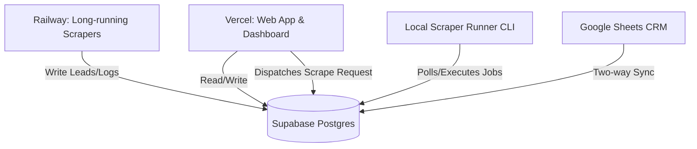
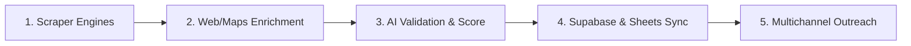

# B2B Lead Generation Automation — Architecture & Developer Review

This document provides a professional code and architecture review of the B2B Lead Generation Automation platform. It reviews the software pipeline (scraping, enrichment, sync, outreach) and the client-facing website development (dynamic mockup engine, visual previews, interactive widgets).

---

## 1. System Architecture Overview

The platform uses a hybrid serverless/persistent architecture to bypass request timeout constraints and maintain a single source of truth database.

### Core Architecture Components
1. **Frontend / Dashboard (Vercel)**: Next.js App Router-based application serving the agent dashboard, CRM, settings configuration, and client-facing landing page previews.
2. **Database Layer (Supabase)**: A relational PostgreSQL database storing lead records, DNC lists, system execution logs, custom visual/copy overrides, and background scrape jobs.
3. **Local/Railway Scraper Engine**: Playwright-based background scrapers that run on persistent hosting (Railway/Local Machine) to avoid Vercel's serverless timeout limitations.
4. **CRM Sync (Google Sheets & Google Apps Script)**: Bi-directional synchronizer that bridges PostgreSQL database records with client-friendly Google Sheet tabs.

---

## 2. Software Pipeline Review

The B2B lead generation workflow is structured as a multi-stage pipeline:

### A. Scraping Engine & Queue Delegation
- **Scraper Implementations**: Includes dedicated endpoints for **Google Places API**, **Jiji.ng Crawler**, **OpenStreetMap (OSM)**, **DuckDuckGo**, and social platforms.
- **Queue Delegation Interceptor (`src/app/api/scrape/queue.ts`)**:
  - Intercepts incoming scraping requests.
  - If `SCRAPER_EXECUTION_MODE` is set to `local`, it generates a `queued` status immediately, writing a scrape job record in Supabase.
  - This decouples the API request from execution, preventing serverless gateway timeouts.
- **Queue Worker (`scripts/local_job_runner.ts`)**:
  - Runs a lightweight polling loop (every 3 seconds) that queries Supabase for `queued` jobs, processes them locally by triggering the target scraper with `x-bypass-queue: true`, and updates the status to `completed` or `failed`.
  - Clears hung execution cycles during startup using a recovery routine (`resetStuckJobs`).

### B. Lead Enrichment Pipeline (`src/lib/leadEnricher.ts`)
The enrichment pipeline represents a sophisticated three-tier approach to extracting business data:
1. **Tier 1 (Instant Snippet Parsing)**: Extracts email and phone candidates using optimized regular expressions over plain text/HTML snippets. Ignores dummy domains (e.g., `example.com`, `sentry.io`).
2. **Tier 2 (Parallel Website Crawling)**:
   - Uses `cheerio` to fetch the business homepage and extract social links (Facebook, Instagram, LinkedIn, TikTok, Twitter, YouTube), telephone links (`tel:`), and mailto email links (`mailto:`).
   - If contact details are missing, it identifies links matching `contact`, `about`, or `info` path keywords and crawls up to **two subpages concurrently** via `Promise.all` to compile missing information.
3. **Tier 3 (Robust Google Maps Phone Scrape)**:
   - **Strategy 1 (Attributes)**: Reads the `data-item-id` attribute (e.g. `phone:tel:...`) of the maps button directly.
   - **Strategy 2 (Reveal Click)**: Simulates clicking the button, waiting 1.2 seconds, and scanning for exposed phone span elements.
   - **Strategy 3 (Text Fallback)**: Grabs the direct text content from the button element.

### C. AI Lead Validation & Scoring
- Uses the **Gemini 1.5 Flash API** to rate lead quality (out of 10) before storage.
- Classifies candidate relevance based on:
  - Commercial intent/activity (does the business have a budget?).
  - Website need (does it lack a website, or is the current website outdated?).
- Prevents wasting marketing spend by filtering out unqualified leads (relevance score < 5).

### D. Multi-channel Outreach Engine
- **Email (`src/lib/email.ts`)**: Uses dynamic templating. Connects to Gmail API via OAuth (with automated refresh tokens), Resend, Brevo, SMTP, or SendGrid.
- **WhatsApp (`src/lib/whatsapp.ts`)**: Integrates Meta Cloud API, Whapi, Evolution API, or a self-hosted Baileys WhatsApp client (which allows agents to pair their personal phone via a QR code).
- **SMS (`src/lib/sms.ts`)**: Supports Termii, Africa's Talking, or custom HTTP SMS dispatch gateways.
- **DNC Verification**: Validates lead E.164 phone numbers and domains against the `dnc` table before triggering any message sending.
- **Dry Run Safety**: Enforces a global `dryRun` configuration flag to prevent accidental outreach during testing.

---

## 3. Website & Visual Mockup Development Review

The client-facing preview engine (`src/components/LandingPage.tsx`) is designed to create a "wow" factor by rendering highly tailored, functional mockups of upgraded websites based on scraped lead data.

### A. Dynamic Mockup Engine
- **Presets System**: Includes 8 pre-configured visual presets based on business categories (Medical, Dental, Auto, Salon, Restaurant, Repairs, Gym, Consulting).
- **Style Injection**: Automatically resolves typography parameters, applying fonts from Google Fonts at runtime (Outfit, Chivo, Playfair Display) and injecting customized styling variables.
- **Custom HTML Injection**: Dynamically injects script tags and HTML inside `document.head` and `document.body` based on database overrides, allowing custom tracking or styling.

### B. Scraped Metadata Visualization
- **Hours Panel**: Displays business hours parsed from the Google Maps scraping payload.
- **Photo Gallery**: Pulls Unsplash fallbacks or live Google Place photo references.
- **Reviews Section**: Populates client testimonial sliders with genuine review text scraped from the lead's Google Maps profile.
- **Social Media Footer**: Dynamically displays icons for Facebook, Instagram, LinkedIn, or TikTok matching the links extracted by the website crawler.

### C. Category-Specific Simulation Widgets
To drive conversions, the landing page features interactive simulations:
- **Quote Estimator**: Let's users choose features (payment gateways, CRM logs, WhatsApp drip campaigns) to calculate pricing and download a simulated branded invoice.
- **E-Commerce Store**: Supports adding products to a shopping cart, triggering a **mock Paystack checkout popup**, and simulating successful payments.
- **Table Reservation**: Simulates table booking with options to pre-order food and prints a simulated kitchen receipt.
- **Patient Intake**: Captures patient details, procedures, and insurance provider selections, simulating automated email and calendar syncs.
- **Auto Valuation**: Simulates vehicle appraisal allowance estimates based on brand, mileage, and vehicle condition.

### D. Interactive Live WhatsApp Chat Simulator
- Upon submitting any widget form, the system renders a floating simulated WhatsApp chat panel.
- Runs an asynchronous, delayed message sequence simulating real-time interactions:
  1. *Customer message*: Confirms details of their booking.
  2. *Bot auto-reply*: Dispatches forms or thank-you templates.
  3. *Internal Agent alert*: Demonstrates how the system routes high-intent lead details straight to the sales team's WhatsApp app.

### E. Agent Utility & Customizer Panel
- Agents can override styling, copywriting, and widgets on the fly.
- **AI Visual Redesign**: Connects to the Gemini API to allow agents to type prompts (e.g. *"make it look like a dark mode luxury watch shop"*) and generates updated styling tokens dynamically.
- **n8n Webhook Integration**: Supports forwarding form submissions to n8n workflows (`n8nWebhookUrl`) when the lead notes include scaling tags (`[scaling: n8n]`), enabling easy enterprise scaling.

---

## 4. Code Quality, Security & Reliability Assessment

### Code Quality Strengths
- **Functional Isolation**: Services (email, SMS, WhatsApp, database) are decoupled in `src/lib/`, making it easy to swap service providers.
- **Stealth Scrape Configuration**: Includes timeout controls and abort controllers to prevent requests from hanging or being detected as bots.
- **Normalized Data Formats**: Enforces standardized formats (e.g. E.164 phone formats) at the database layer.

### Security Concerns & Risks
1. **Service Role Key Usage**: The local queue runner and client-facing pages read `SUPABASE_SERVICE_ROLE_KEY`. Service role keys bypass Row-Level Security (RLS). Ensure this key is *never* exposed to the client browser. Use the public `anon` key for frontend-facing calls and restrict service role keys to server-side routes.
2. **Cheerio Abort Controller**: Cheerio fetches are wrapped in timeout abort controllers (6000ms), protecting the server from hung socket pools when crawling slow websites.
3. **SQL Injection Vulnerabilities**: Review database queries to ensure all parameters are bound. Using the Supabase JS client (`supabase.from().insert()`) handles sanitization automatically, which the application implements.

---

## 5. Architectural Recommendations

To help transition this platform from a working prototype to an enterprise-grade SaaS, consider the following enhancements:

### Recommendation 1: Database Connection Pooling
- **Issue**: Serverless functions open database connections on every request, which can quickly exhaust PostgreSQL's connection limits during concurrent scraping runs.
- **Fix**: Use connection pooling. Point the application's connection string to Supabase's built-in **connection pooler** (Session or Transaction mode, using port 6543) instead of direct database access (port 5432).

### Recommendation 2: Scraper Rate Limiting & Proxy Rotation
- **Issue**: Google Maps details queries and Jiji crawling will trigger IP blocklists or captcha challenges when executed at scale from a single IP address.
- **Fix**: Integrate a proxy rotation service (e.g., Bright Data, ZenRows) inside `src/lib/browserLauncher.ts` or route maps queries through an official search aggregator API (like Apify/SerpApi) when scraping volume exceeds 1,000 runs/day.

### Recommendation 3: Implement Webhook Signature Verification
- **Issue**: The Paystack callback and simulated test lead endpoints do not currently verify webhook signatures, meaning malicious clients could trigger mock payment success events.
- **Fix**: Implement cryptographically verified signature checks (HMAC verification) for incoming callbacks from payment providers.

### Recommendation 4: Cron-Driven stuck Job Recovery
- **Issue**: If the local queue runner crashes mid-execution, jobs remain in the `running` state indefinitely until the runner is manually restarted.
- **Fix**: Add a cron job or Supabase Database Webhook that checks for jobs stuck in the `running` state for more than 15 minutes, automatically resetting them to `queued` or marking them as `failed`.

---
*Review compiled by Antigravity.*
