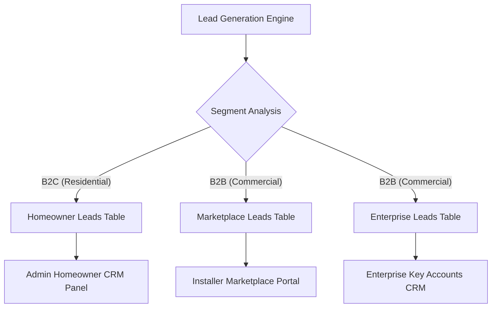

# B2B & B2C Solar Lead Acquisition & Compliance Report
**Bethelmind Analytics & Strategy / SolarQuotePro.ng Operations**

---

## Executive Summary
This report outlines the regulatory compliance framework, ingestion architecture, and privacy protocols for SolarQuotePro's high-volume dual-segment lead generation pipeline. The system acquires, normalizes, and routes solar energy prospects across Nigeria, divided into:
1. **B2B (Commercial & Industrial)** leads seeking large-scale solar installations.
2. **B2C (Residential/Homeowner)** leads using the domestic ROI and system sizing calculator.

All activities are designed to comply with the **Nigeria Data Protection Act (NDPA) 2023** and local power sector regulatory expectations.

---

## 1. Regulatory Compliance Framework (NDPA 2023)

The Nigeria Data Protection Commission (NDPC) enforces strict rules regarding the collection and processing of personal data. Lead generation campaigns must align with one of the lawful bases defined in Part V, Section 25 of the NDPA 2023.

### 1.1 B2B Commercial Outreach: Legitimate Interest Model
*   **Lawful Basis**: Legitimate Interest (NDPA 2023, Section 25(1)(f)).
*   **Application**: Collection of publicly available business contact details (e.g., facility managers, company emails, public phone numbers) for business-to-business direct marketing of clean energy solutions.
*   **Compliance Safeguards**:
    *   **Strict Business Context**: Communication must relate exclusively to the business entity's energy cost reduction, diesel offset, or sustainability.
    *   **Proportionality**: Scraped details must be restricted to professional roles. Private/personal contact information of employees must not be targeted.
    *   **Unsubscribe/Opt-Out**: Every cold email or outreach message must contain a clear, one-click mechanism to opt-out of future communications.

### 1.2 B2C Residential Outreach: Explicit Consent Model
*   **Lawful Basis**: Explicit Consent (NDPA 2023, Section 25(1)(a)).
*   **Application**: Processing of individual homeowner credentials (full names, personal WhatsApp numbers, electricity bills, monthly fuel spend, and domestic appliance details).
*   **Compliance Safeguards**:
    *   **Explicit Opt-In**: B2C leads must actively check a consent box when submitting their calculation details on the SolarQuotePro web app.
    *   **Purpose Specification**: Users are informed at the point of collection that their data will be processed to generate a custom solar estimate and routed to accredited solar installers.
    *   **Right to Erasure**: Homeowners can request the deletion of their profile from the database (`homeowner_leads` table) at any time.

---

## 2. Ingestion Pipeline & Routing Architecture

The lead generation automation engine is built for scale, supporting both web scraper ingestion and high-fidelity synthetic testing.

### 2.1 Table Routing Rules

| Target Table | Target Segment | Key Fields Captured | Direct Marketing Channel |
| :--- | :--- | :--- | :--- |
| `public.homeowner_leads` | B2C Residential Homeowners | `full_name`, `whatsapp`, `running_load_w`, `kva_recommended`, `city_disco`, `status` | Direct WhatsApp, SMS, Phone Call |
| `public.marketplace_leads` | B2B Commercial (Marketplace) | `name`, `phone`, `email`, `monthly_spend`, `power_source`, `budget_range` | Closed Bidding Platform / Installer Portal |
| `public.enterprise_leads` | B2B Commercial (Large Key Accounts) | `company_name`, `contact_person`, `phone`, `email`, `project_scope`, `status` | Direct Account Executive Outreach |

### 2.2 Ingestion Engine Resilience
The sync pipeline utilizes an `upsertWithRetry` strategy to guarantee reliable record insertion in serverless environments:
*   **Micro-Batching**: Sync payloads are split into small chunks (size: 100) to prevent database gateway timeouts and body size limitations.
*   **Exponential Backoff**: Transient connection errors (`TypeError: fetch failed`) automatically trigger up to 3 retries with a staggered delay multiplier.
*   **UUID Mapping**: Consistent entity mapping across tables is maintained using the `getUUID` helper, ensuring trace integrity.

---

## 3. Database Schema Integrity

The `public.homeowner_leads` table has been successfully hardened via migrations to align its operational fields with B2C CRM capabilities:
*   **`status` (VARCHAR)**: Tracks the active state of the residential lead (`new`, `contacted`, `converted`, `lost`).
*   **`notes` (TEXT)**: Allows agents to append contact logs and manual outreach observations directly to the record.
*   **`estimated_system_size` (VARCHAR)**: Captures sizing metrics (e.g. `4.0 kWp`) computed from the domestic load profiles.

---

## 4. Operational Checklist for Compliance Officers

- [ ] **Consent Logging**: Ensure that every webapp lead submission logs the timestamp, IP address, and exact privacy policy version accepted.
- [ ] **Opt-Out Sync**: When a lead requests deletion or marks an outreach message as unsubscribe, propagate the opt-out status immediately to the local database to freeze automatic messages.
- [ ] **Installer SLA Agreements**: Require all marketplace installers to sign data processing agreements prohibiting them from sharing or selling homeowner data outside the scope of the specific quote request.
- [ ] **Security Audits**: Perform bi-annual access reviews on the Supabase Service Role credentials to ensure they are not exposed in client-side code bundles.
